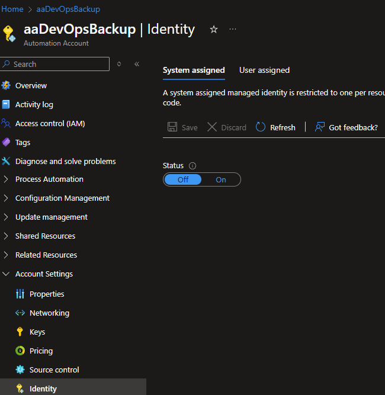
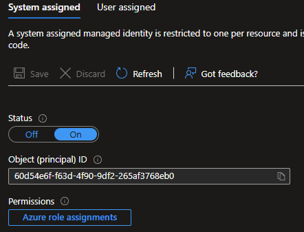

#Setup Automation Account
This documentation will not cover the basics of setting up an Azure Automation account.

It also does not provide any explanation to System- or User Assigned Identities and the differences/advantages/disadvantages to these.

Please read Microsoft's documentation on these subjects.

The Automation account for the documentation is called 'aaDevOpsBackup'

##Identity
To connect to resources, an account is required to access them.

Azure Automation provides the ability to use either a System- or User Assigned Identity. It's up to you to decide which to use, but the documentation is for using a System Managed Identity.

Under the Identity tab, choose either System assigned or User assigned.

Proceeding with System assigned, click the Status to On and click Save.

Now we have an account and we can grant that account some permissions in Azure DevOps.