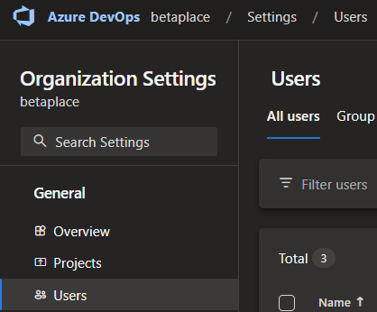
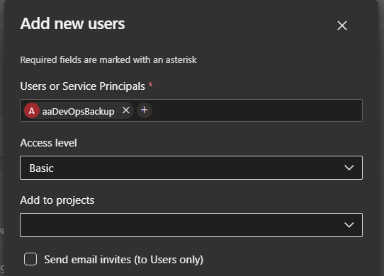

#Azure DevOps.
Open Azure DevOps - my test organization is called "BetaPlace", so https://dev.azure.com/BetaPlace for me in a browser.

Go to "Organization settings" in the lower left corner and choose Users.

Click Add users in the right top side.

At 'Users or Service Principals' enter the name of the Azure Automation account created earlier. In my case 'aaDevOpsBackup'. If you are using a User assiged identity, it's the name of the user identity.

Set 'Access level' to 'Stakeholder'. This is very important, as Basic does not grant the permission to export.

If you only plan on backing up a single or a few project, you can choose it here. Otherwise leave 'Add to Projects' empty for now.

Uncheck 'Send email invites' if you want - It won't send mail anyway.

Click Add.

It takes a few seconds to add the service principal.

##Azure DevOps project access.
If you previously selected only a single or a few project to grant access to, you can see/revoke this access under each Project's 'Project settings'.

The identity should be present in the "Contributors" group.
Here you can remove it, to revoke direct access or on new projects, add it to be able to backup.

Please be aware you need to maintain this access - Add for new projects.

##Azure DevOps - Access to all projects
In order to backup all projects, existing and future ones, with minimal effort, this method can be used.

Please note this does grant significant permissions to all projects, so you must restrict access to your Automation Account / User identity.
It's equivalent to granting Contributor to individual projects.

Under 'Organization settings', choose 'Permissions'.
Click 'Project Collection Administrators' and 'Members'.
Click 'Add'

At 'Users or Service Principals' enter the name of the Azure Automation account created earlier. In my case 'aaDevOpsBackup'. If you are using a User assiged identity, it's the name of the user identity.

The identity now has full access to all repositories, branches, pipelines,  and boards in DevOps.

If you know of a better way to limit scope, please let me know.